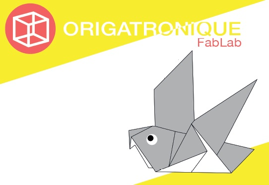

# Projet Origatronique
A l'occasion de l'édition [Futurapolis 2017](http://www.futurapolis.com/), la [section électronique du FabLab Artilect](https://www.artilect.fr/fab-tronic/) propose un atelier découverte de la programmation des cartes Arduino.

Pour cela, nous allons vous présenter un mélange entre l'[origami](https://fr.wikipedia.org/wiki/Origami) et la [mécatronique](https://fr.wikipedia.org/wiki/M%C3%A9catronique), d'où le nom original d'<b>Origatronique</b>.

Credits
---
Arduino:
- [Arnauld BIGANZOLI](http://tonic.inserm.fr/arnauld-biganzoli-404340.kjsp)

CAO FreeCAD:
- [Pierrick COUTURIER](https://www.thingiverse.com/arofarn/about)

Design:
- [Quentin NUNES](https://www.artilect.fr/section-design-labdesign/)

License
---
  
[Open Hardware](https://fr.wikipedia.org/wiki/Mat%C3%A9riel_libre) 
[MIT License](https://opensource.org/licenses/MIT)
